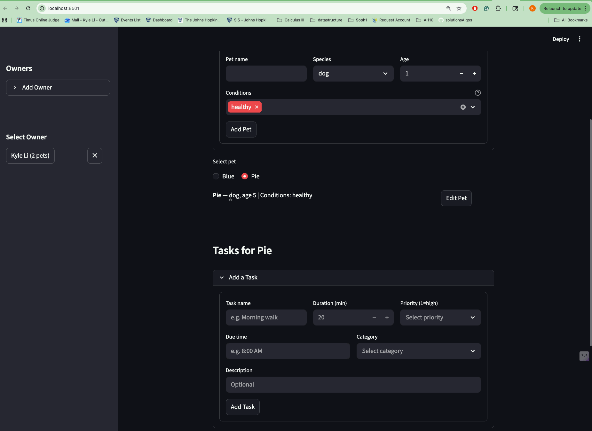
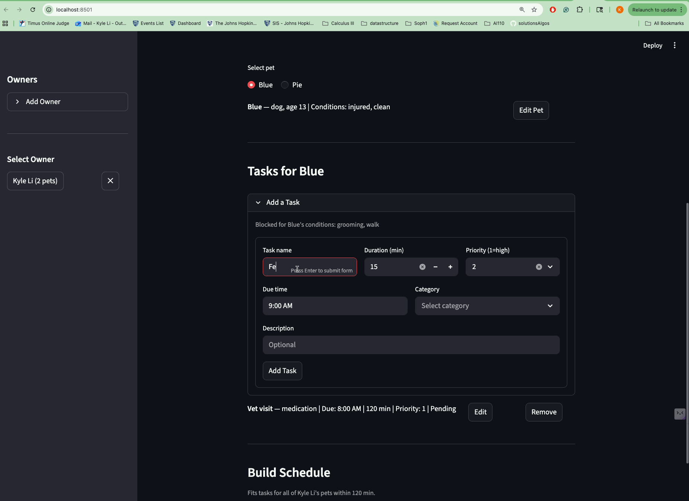

# PawPal+ (Module 2 Project)

You are building **PawPal+**, a Streamlit app that helps a pet owner plan care tasks for their pet.

## Scenario

A busy pet owner needs help staying consistent with pet care. They want an assistant that can:

- Track pet care tasks (walks, feeding, meds, enrichment, grooming, etc.)
- Consider constraints (time available, priority, owner preferences)
- Produce a daily plan and explain why it chose that plan

Your job is to design the system first (UML), then implement the logic in Python, then connect it to the Streamlit UI.

## What you will build

Your final app should:

- Let a user enter basic owner + pet info
- Let a user add/edit tasks (duration + priority at minimum)
- Generate a daily schedule/plan based on constraints and priorities
- Display the plan clearly (and ideally explain the reasoning)
- Include tests for the most important scheduling behaviors

## Getting started

### Structure

#### Classes (`pawpal_system.py`)

| Class       | Purpose                               | Key Attributes                                                                  |
| ----------- | ------------------------------------- | ------------------------------------------------------------------------------- |
| `Task`      | A single care action for a pet        | `name`, `due_time`, `duration` (min), `priority` (1–5), `category`, `completed` |
| `Pet`       | A pet with a list of tasks            | `name`, `species`, `age`, `condition` (list), `tasks`                           |
| `Owner`     | Owns pets and has a daily time budget | `name`, `time_available` (min), `preferences`, `pets`                           |
| `Scheduler` | Generates and validates plans         | `sort_by_time()`, `generate_daily_plan()`, `detect_conflicts()`                 |

#### Algorithmic Features

**Scheduling (`generate_daily_plan`)**
Collects all incomplete tasks across an owner's pets, filters out infeasible ones, sorts by adjusted priority, then greedily fits tasks into the owner's available time budget. The final plan is re-sorted chronologically by `due_time`.

**Priority Adjustment (`_adjusted_priority`)**
Medication tasks are boosted to priority 1 when a pet is marked `sick`, ensuring they always schedule first regardless of their assigned priority.

**Feasibility Filtering (`_is_feasible`)**
Tasks are excluded if:

- The pet's `condition` blocks the task category (e.g. an `injured` or `elderly` pet cannot be assigned `walk` tasks)

**Conflict Detection (`detect_conflicts`)**
Compares every pair of tasks across all pets for the same owner. If two tasks share the same parsed `due_time` (resolved to minutes since midnight), they are flagged as a conflict.

**Time Parsing (`sort_by_time`)**
Due times like `"8:00 AM"` or `"6:00 PM"` are parsed into an integer (minutes since midnight) for reliable chronological sorting. Unparseable times float to the end.

#### Files

| File                   | Role                                              |
| ---------------------- | ------------------------------------------------- |
| `pawpal_system.py`     | All classes and scheduling logic                  |
| `app.py`               | Streamlit UI — owners, pets, tasks, schedule view |
| `main.py`              | Standalone demo script (no UI)                    |
| `tests/test_pawpal.py` | Pytest tests for scheduling behavior              |

### Setup

```bash
python -m venv .venv
source .venv/bin/activate  # Windows: .venv\Scripts\activate
pip install -r requirements.txt
```

### Running test.py

1. I have the following tests in test_pawpal.py:
   1. def test_sort_by_time_returns_chronological_order(): Ensures that regardless of what order the tasks are created in, the finalized task list is returned sorted based on the due_time variable.
   2. test_generate_daily_plan_with_no_tasks(): Tests that the if the pet has no tasks when creating a daily plan, no daily plan is printed out.
   3. test_detect_conflicts_two_pets_same_time(): Checks if the owner has made two tasks for pets that have the same due time.
   4. test_generate_daily_plan_respects_time_budget(): Verifies that the owner does not add tasks that go over the budgeted time.
2. To run these tests, do python3 -m pytest tests/test_pawpal.py

### Running the app

1. Run streamlit run app.py in terminal
2. Will open a new app in your browser
3. Create an owner
4. Inside the owner page, can add pet attributes like name, species, age and any conditions to be noted (Sick? Injured? Elderly? Clean?) then click "save"
   1. The pets added will show up on the bottom, you have the option to either edit or remove details.
5. You can toggle between each pet by clicking on a radio button. This is important to distinguish which pet gets which task.
6. Tasks you need to add a task name, duration (if exceeds your budgeted time, won't be scheduled), priority (1-5, smaller number means higher priority), time to start, category and description (any further context)
7. Click "add task"
8. You can finally click "Generate schedule" to display what tasks can be carried out given your parameters.

### Suggested workflow

1. Read the scenario carefully and identify requirements and edge cases.
2. Draft a UML diagram (classes, attributes, methods, relationships).
3. Convert UML into Python class stubs (no logic yet).
4. Implement scheduling logic in small increments.
5. Add tests to verify key behaviors.
6. Connect your logic to the Streamlit UI in `app.py`.
7. Refine UML so it matches what you actually built.

### Demo

1. A walkthrough of the pet scheduler:
   1. 
2. Time conflict detection algorithm demo:
   1. 
3. Sort pet tasks based on due time:
   1. 
4. Exclude task categorise based on condition:
   1. 
5. Scheduling based on priority (Greedy algorithm):
   1. Will choose the higher priority task even if it takes up all the time.
   2. 
